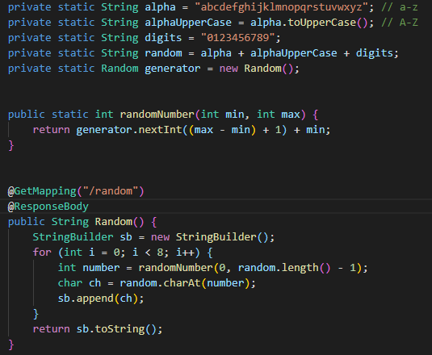
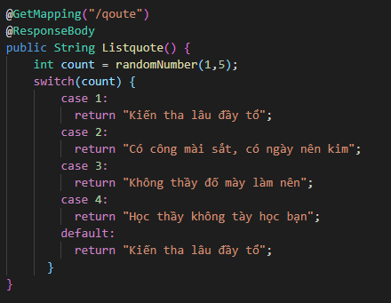
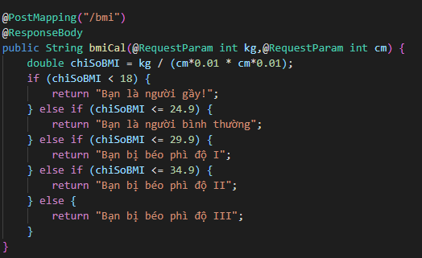
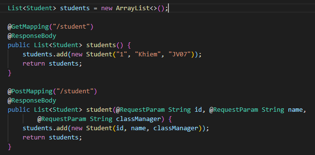

# Bài tập buổi 1
## Phần lí thuyết 
1. Các tham số
###
`groupID` tên cơ sở duy nhất của công ty hoặc nhóm đã tạo ra dự án
###
`artifactID` tên riêng của dự án
###
2.
Theo quy định groupId phải tuân theo các quy tắc tên gói (Java’s package name rules) của Java. Điều này có nghĩa là nó bắt đầu với một tên miền đảo ngược.
###
Mục đích là tạo ra được tên định danh duy nhất và tạo ra quy tắc chung cho cách đặt tên, tư duy đặt tên đi từ quy mô lớn đến nhỏ cũng giống như khi đặt tên package name
###
3. 2 cơ chế để quản lý thư viện SpringBoot : `Maven` và `Gradle`
###
4. File pom.xml để cấu hình ứng dụng
###
5. Trong file pom.xml có các thẻ `dependency` là các thư viện đã thêm vào dự án
###
6. `@Controller` là nơi tiếp nhận các thông tin request từ phía người dùng. Nó có nhiệm vụ đón nhận các yêu cầu (kèm theo thông tin request) và chuyển các yêu cầu này xuống cho tầng `@Serivce` xử lý logic
###
7. `@RequestMapping`là nơi tạo đường dẫn dẫn đến phần trang web . Ngoài thuộc tính `value` ta có thêm 3 thuộc tính `method` , `headers` và `produces`;  có thể map request với class xử lý request
###
8. `@RequestBody` được dùng để ánh xạ HttpRequest body sang một domain object tự động.
   `@ResponseBody` annotation được dùng để thông báo với controller rằng Java Object trả về cho client sẽ tự động ánh xạ sang JSON và chuyển vào HttpResponse.
9. `@RequestParam` được dùng để trích xuất dữ liệu từ request query(phần request query bắt đầu từ dấu ?param1=2&param3=5).
 `@PathVariable` thì được dùng để trích xuất dữ liệu từ URL path.\
###
###
10. `@PathVariable` không thể thay đổi thứ tự các thành phần của đường dẫn
11. `@GetMapping` tạo ra đường dẫn của phương thức lấy dữ liệu
`@PostMapping` tạo ra đường dẫn cửa phương thức Post dữ liệu
###
12. Thông số produces để định hình kiểu dữ liệu trả về
13. Vẫn giống như `@PathVariable` tuy nhiên `@RequestBody` sẽ lấy toàn bộ dữ liệu của toàn class message dưới dạng key value(Chuyển thành 1 Java object)
14. Ta có thể đổi cổng truy cập ứng dụng tại `application.property` với thuộc tính `sever.port`
## Phần bài tập
### Bài 1 

### Bài 2 

### Bài 3 

### Bài 4 
